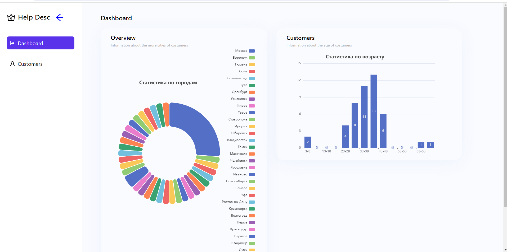
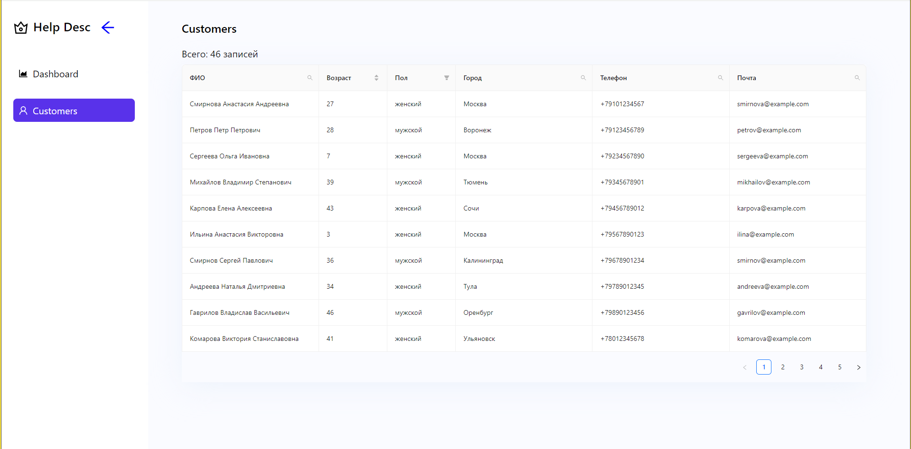

# Тестовое задание
#### **Для старта: yarn -> yarn dev | npm install -> npm run dev**
### Библиотеки: 
1. React, React Router Dom
2. Antd (готовые компоненты), Echarts (графики), frame-motion (анимации)
3. classnames (для объединения classNames)
4. SCSS modules
5. Сборщик Vite (с настроеными альясами)
### Использовала mocks для работы с данными.

